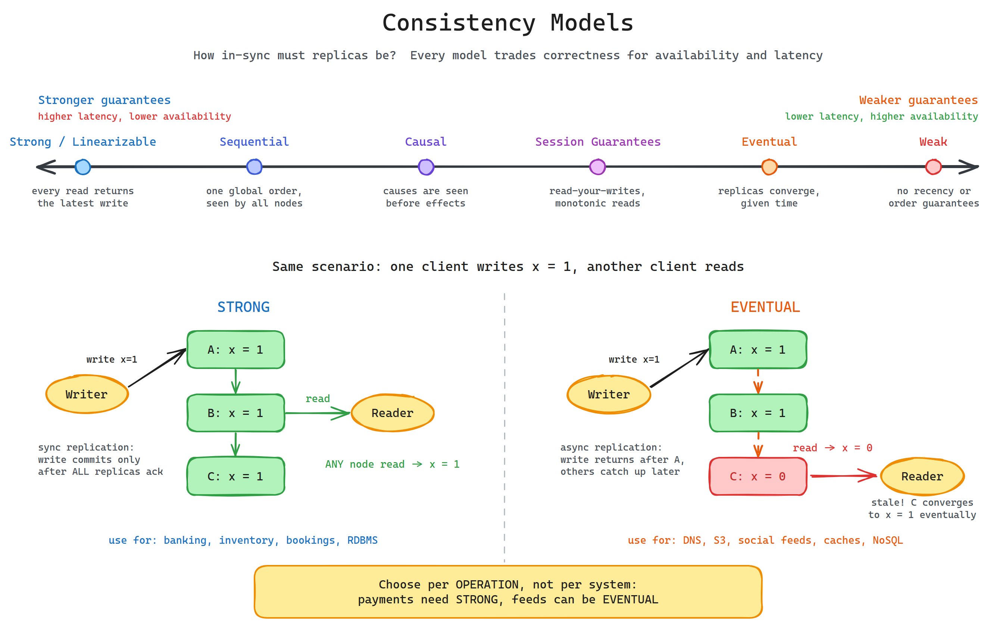
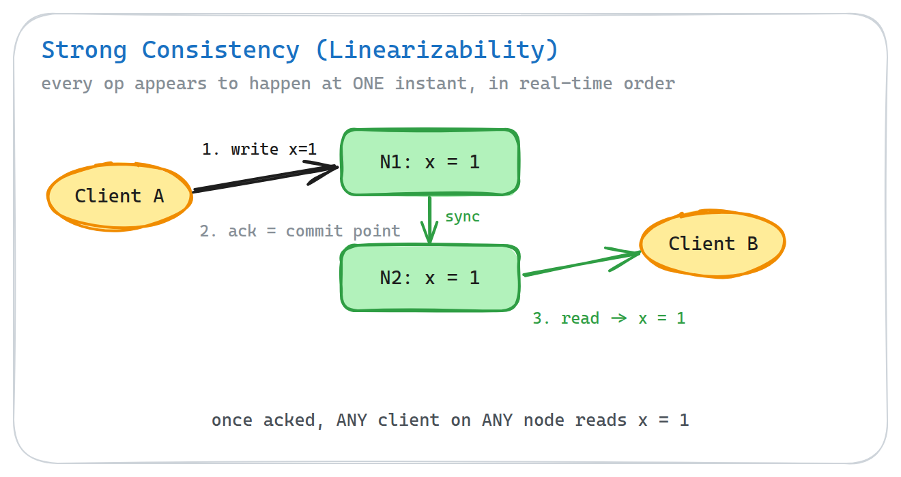
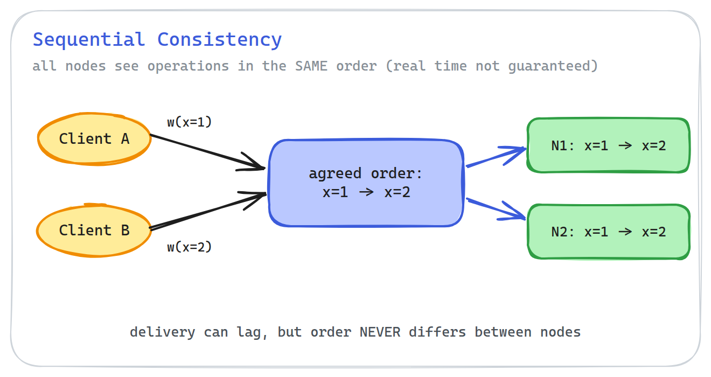
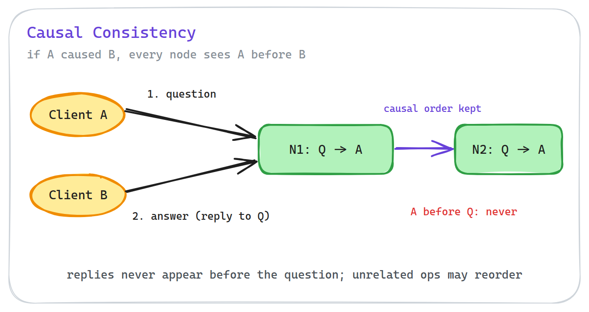
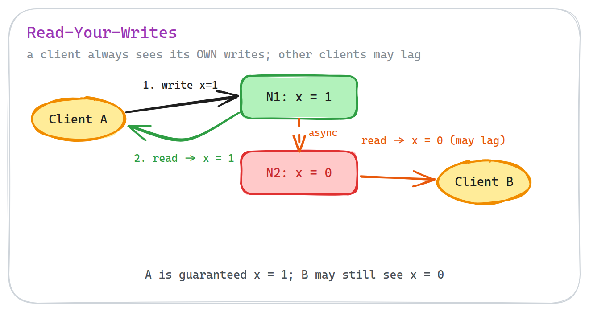
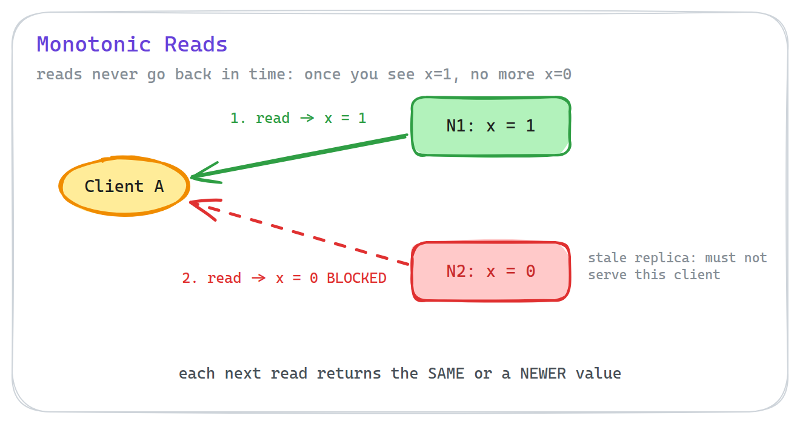
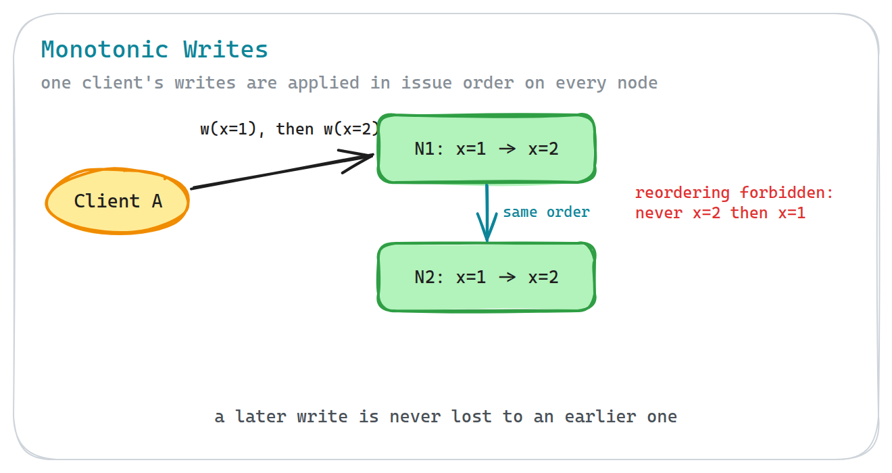
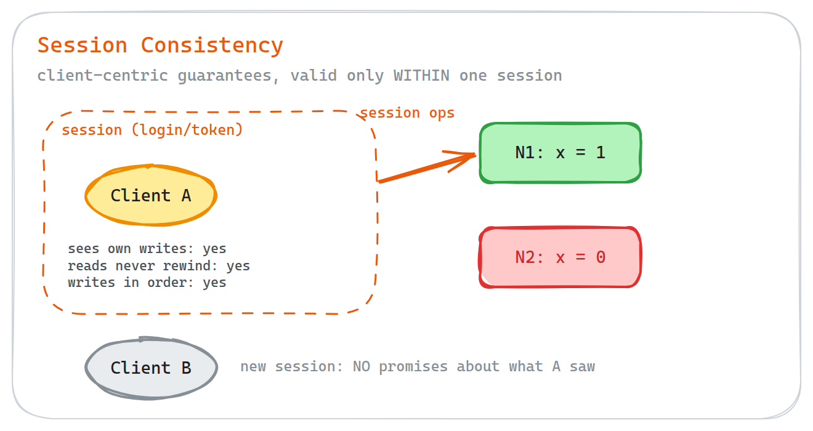
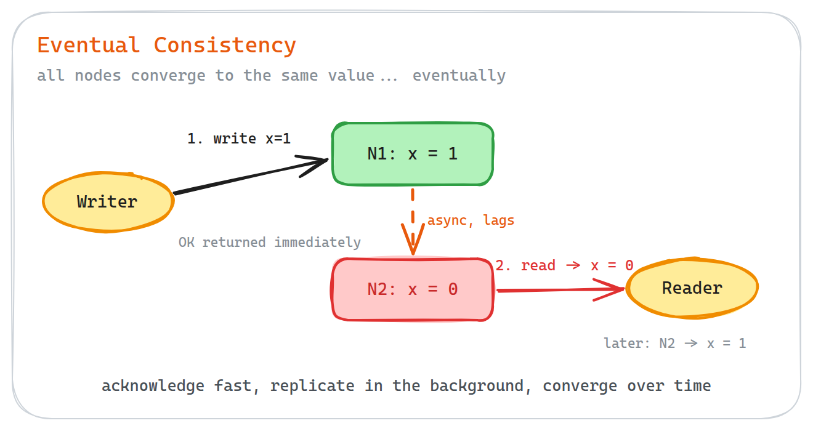
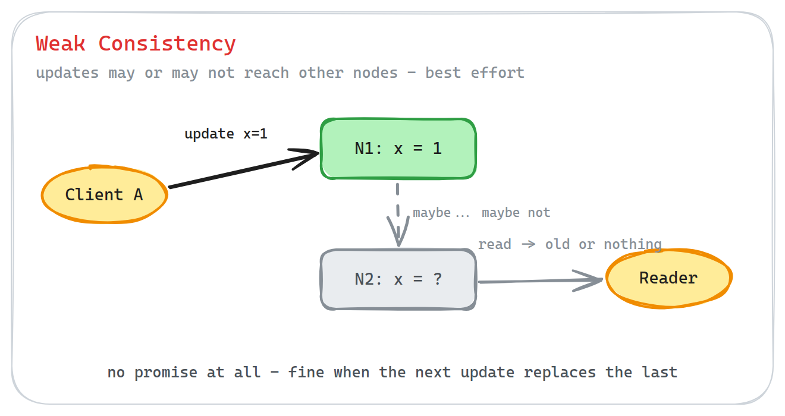

# Consistency Models in Distributed Systems, Explained Simply

*What "consistent data" really means when your data lives on more than one machine — with diagrams, trade-offs, and a cheat sheet at the end.*

---

The moment you copy your data onto a second server, you inherit a hard question:

**When one copy changes, what do readers of the other copies see?**

The answer is not "they instantly see the new value." Networks are slow, messages get delayed, and machines fail. So every distributed system has to pick a *promise* it makes to its users about how fresh and how ordered their data will be.

That promise is called a **consistency model**.

A stronger promise makes your application simpler but makes every operation slower and less available. A weaker promise makes the system fast and always-on, but pushes the complexity onto you, the developer. Every model below is just a different point on that slider.

Here is the full menu, from the strongest promise to the weakest:

1. Strong Consistency (Linearizability)
2. Sequential Consistency
3. Causal Consistency
4. Read-Your-Writes Consistency
5. Monotonic Reads Consistency
6. Monotonic Writes Consistency
7. Session Consistency
8. Eventual Consistency
9. Weak Consistency

Let's walk through each one.

---

## 1. Strong Consistency (Linearizability)

**The promise:** every read returns the latest write. The system behaves as if there were only one copy of the data.

Formally this is called **linearizability**: every operation appears to take effect at a single instant in time, somewhere between when you sent the request and when you got the response. Once a write is acknowledged, *every* client reading from *any* node sees the new value. No exceptions.

To keep this promise, a write must be replicated to the other nodes (or a quorum of them) *before* the client gets its "OK". That coordination is exactly where the cost comes from.

**Benefits**

- All nodes see the same data at the same time — no stale reads, ever.
- Simple application logic: developers never have to reason about inconsistent data.
- Highest data integrity and reliability.

**Drawbacks**

- Higher latency: every write waits for coordination between nodes.
- Lower availability: if nodes can't reach each other, the system may refuse requests rather than serve stale data.
- Resource-intensive: more network round trips per operation.

**Used in**

- Banking and financial systems, where data integrity is critical.
- Inventory and booking systems (you can't sell the same seat twice).
- Relational databases, where committed data must be immediately visible.
- Coordination services like ZooKeeper and etcd.

---

## 2. Sequential Consistency

**The promise:** all nodes see all operations in the *same order*. That order respects what each individual client did, but it does not have to match real time.

The subtle difference from strong consistency: if you write `x = 1` and get an acknowledgment, another client might still read the old value for a moment — but no two nodes will ever disagree about the *order* in which writes happened. Everyone replays the same story; some just replay it a little late.

**Benefits**

- Simpler to reason about than weaker models: there is one global order of events.
- Cheaper than linearizability: nodes don't have to synchronize with real time.

**Drawbacks**

- Reads can still be stale — "same order" does not mean "right now".
- Still needs coordination to agree on the single order, so it is not free.

**Used in**

- Replicated state machines and consensus-based replication (every replica applies the same log in the same order).
- Backing stores for distributed locks and leader election, where agreement on order matters more than wall-clock freshness.

---

## 3. Causal Consistency

**The promise:** if operation A *caused* operation B, every node sees A before B. Operations that are unrelated may be seen in different orders.

The classic example: a question and its answer. If someone replies "Yes, at 6 pm" to "Are we still meeting today?", no reader should ever see the answer before the question. But two unrelated posts from different users? Their order doesn't matter, so the system doesn't pay to enforce it.

**Benefits**

- Low latency and high availability: only related operations need ordering.
- Prevents the most confusing anomalies (effects appearing before their causes).
- A sweet spot: stronger than eventual, much cheaper than strong.

**Drawbacks**

- The system must track what depends on what (usually with vector clocks or similar), which adds complexity.
- Unrelated operations can still appear in different orders on different nodes.

**Used in**

- Comment threads and replies on social platforms like Reddit.
- Messaging apps, where a reply must never appear before the original message.
- Distributed databases and key-value stores with causal ordering support.

---

## 4. Read-Your-Writes Consistency

**The promise:** after you write something, *your own* reads will always include that write. Other clients may still see old data for a while.

This is the guarantee that fixes the most embarrassing bug in replicated systems: a user updates their profile photo, refreshes the page, and sees the *old* photo because the read went to a replica that hasn't caught up yet.

**Benefits**

- Users never "lose" their own updates — a huge UX win.
- Much cheaper than strong consistency: the guarantee is per-user, not global.

**Drawbacks**

- Only helps the writer; other users can still read stale data.
- Needs implementation tricks: route the user's reads to the up-to-date replica, or wait until replication catches up.

**Used in**

- User profiles and settings pages (you must see your own edit immediately).
- Social media: you always see your own post right after publishing it.
- Any "edit, then view" flow served by read replicas.

---

## 5. Monotonic Reads Consistency

**The promise:** once you have seen a value, you will never see an *older* one. Reads never go backwards in time.

Without it, this can happen: you read `x = 1` from an up-to-date replica, then your next request lands on a lagging replica and returns `x = 0`. From the user's point of view, the data just travelled back in time — a new email appears, then vanishes on refresh.

**Benefits**

- No "time travel": data never disappears after you've seen it.
- Cheap to provide — usually just means pinning a user to a replica.

**Drawbacks**

- Says nothing about freshness; you may consistently read data that is old.
- Pinning users to replicas complicates load balancing and failover.

**Used in**

- Inboxes, notification lists, and feeds, where items must not vanish between refreshes.
- Any read-heavy system with multiple replicas behind a load balancer.

---

## 6. Monotonic Writes Consistency

**The promise:** writes from the same client are applied in the order they were issued — on every node.

If you set `x = 1` and then `x = 2`, no replica will ever apply them in reverse and end up stuck at `x = 1`. Without this guarantee, a later update can be silently undone by an earlier one arriving late.

**Benefits**

- A client's later write is never lost to its earlier write.
- Makes sequences of updates (drafts, counters, status changes) safe by default.

**Drawbacks**

- Only orders writes from the *same* client; says nothing about other clients' writes.
- Replicas must track per-client write order, which adds bookkeeping.

**Used in**

- Document editing and autosave: version 2 must never be overwritten by version 1.
- Status updates and configuration changes pushed by a single writer.

---

## 7. Session Consistency

**The promise:** within one session, you get read-your-writes and monotonic reads/writes bundled together. When the session ends, the promises reset.

A session is typically a login, a connection, or a token. Inside it, the world behaves sanely *for you*: you see your writes, your reads never rewind, your writes apply in order. Another user — or you, after re-logging in from another device — gets no such promise about what you did.

This family of per-client promises (4–7) is often grouped under the name **client-centric consistency**.

**Benefits**

- Feels like strong consistency to each individual user.
- Costs far less than actual strong consistency — guarantees are scoped, not global.
- A practical default: this is what Azure Cosmos DB ships as its default consistency level.

**Drawbacks**

- Guarantees vanish across sessions and across users.
- The system must carry session state (tokens, replica pinning) to enforce it.

**Used in**

- Shopping carts: your cart looks right to you across the whole visit.
- Web applications with sticky sessions on top of replicated storage.
- Cosmos DB "Session" consistency level.

---

## 8. Eventual Consistency

**The promise:** if writes stop, all nodes will *eventually* converge to the same value. Until then, reads may return stale data.

This is the workhorse of planet-scale systems. A write is acknowledged as soon as one node has it; replication to the other nodes happens in the background. You give up "read the latest value" and get availability and speed in return.

**Benefits**

- High availability: any node can accept reads and writes, even during network trouble.
- Low latency: no waiting for cross-node coordination.
- Scales beautifully: add nodes without slowing down writes.

**Drawbacks**

- Stale reads, conflicts, and (if conflict handling is sloppy) lost updates.
- Complex application logic: the developer must decide how to detect and resolve conflicts.
- "Eventually" has no deadline — lag is usually milliseconds, but it is not guaranteed.

**Used in**

- NoSQL databases such as DynamoDB and Cassandra.
- DNS — the textbook example: record changes take time to propagate worldwide.
- Object storage such as Amazon S3; email delivery (SMTP); search-engine indexing.
- Social media likes, comments, and follower counts.
- URL shorteners; gossip protocols; leader–follower and multi-leader replication.

---

## 9. Weak Consistency

**The promise:** none. After a write, other nodes *may* see it — or may not. Best effort only.

That sounds useless until you notice a class of data where the *next* update matters more than the last one: a player's position in a game, a frame in a live stream, a packet of audio in a call. If an update is lost, the correct move is to skip it, not to slow everyone down retrieving it.

**Benefits**

- Maximum performance and minimum latency.
- Highest availability — nothing ever waits.

**Drawbacks**

- Stale data, conflicts, and data loss are all possible and unhandled.
- The application must tolerate missing or out-of-order updates by design.

**Used in**

- Real-time multiplayer games (a lost position update is replaced by the next one).
- Live video streaming and VoIP (a dropped frame should be skipped, not replayed).
- Write-behind caches, where the cache and the store are briefly out of sync on purpose.

---

## The Difference Table

| Model | The promise | Latency | Availability | Typical systems |
|---|---|---|---|---|
| Strong / Linearizability | Every read sees the latest write, everywhere | High | Lower | Banking, bookings, RDBMS, ZooKeeper |
| Sequential | Same order of operations on all nodes (not real-time) | Medium–high | Lower | Replicated logs, state machines |
| Causal | Causes are always seen before effects | Medium | High | Comment threads, messaging |
| Read-Your-Writes | You always see your own writes | Low | High | Profile edits, "post then view" |
| Monotonic Reads | Your reads never go back in time | Low | High | Inboxes, feeds behind replicas |
| Monotonic Writes | Your writes apply in the order you issued them | Low | High | Autosave, status updates |
| Session | All three client-centric promises, within a session | Low | High | Shopping carts, Cosmos DB default |
| Eventual | All nodes converge, eventually | Lowest | Highest | DynamoDB, Cassandra, DNS, S3 |
| Weak | No promise at all | Lowest | Highest | Games, live streams, VoIP |

---

## The Decision Table: When to Choose What

| If your requirement is... | Choose | Example |
|---|---|---|
| Wrong data costs money or breaks the law | Strong / Linearizability | Account balances, seat booking, inventory |
| All replicas must agree on one order of events | Sequential | Replicated log, distributed lock backing store |
| Replies must never appear before the original | Causal | Chat, comment threads |
| A user must instantly see their own change | Read-Your-Writes | Profile photo update |
| Data must never vanish between two refreshes | Monotonic Reads | Email inbox, notifications |
| A user's second update must never lose to their first | Monotonic Writes | Document autosave |
| Each user needs a sane, self-consistent view — cheaply | Session | Shopping cart |
| Scale and uptime matter more than freshness | Eventual | Feeds, likes, DNS, object storage |
| Speed is everything and lost updates are fine | Weak | Multiplayer games, live video |

---

## The Takeaway

Consistency is not a yes/no property — it is a slider between "always correct" and "always fast".

And the most useful trick in practice: **choose per operation, not per system**. The same application can process payments with strong consistency and serve its activity feed eventually. Match the promise to the damage a stale read can cause, and you'll get the best of both worlds.

*Thanks for reading! If this helped, a clap or a follow is appreciated.*
